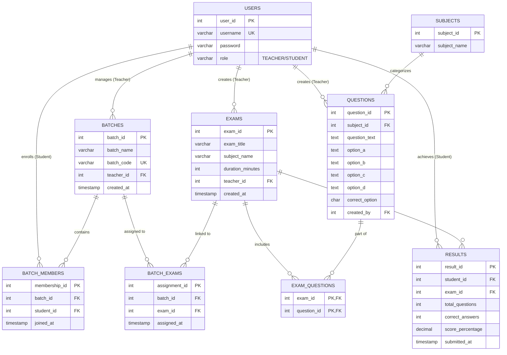

# 🚀 ExamPro: Advanced Online Examination & Analytics System

**ExamPro** is a high-performance, full-stack Java enterprise application designed to digitize the modern classroom. It offers a dual-portal ecosystem—**Teacher Control Center** and **Student Assessment Hub**—built with a focus on real-time data processing, anti-cheat proctoring, and a premium **"Cyber-Dark"** user experience.

Live Demo : https://exampro-z5wh.onrender.com/
---

## 💎 Design System

Unlike standard administrative tools, ExamPro uses a custom-engineered CSS architecture designed to feel like a native mobile app on any device.

### 🔹 Key Features
- **Dynamic Sidebar-to-Header Morph**
  - Desktop: 260px fixed sidebar
  - Mobile (<1024px): Glassmorphic sticky header with Hamburger menu

- **Data-Card Transformation**
  - Tables automatically convert into interactive cards on mobile

- **Touch-First Engineering**
  - 16px Font Locking (prevents auto zoom)
  - 48px Hit Targets (thumb-friendly buttons)
  - Haptic Feedback Mimicry using `:active` scaling

---

## 🛠 Technical Architecture

| Layer        | Technology |
|-------------|-----------|
| Backend     | Java EE (Servlets 4.0) |
| View Engine | JSP (JavaServer Pages) & JSTL 1.2 |
| Database    | MySQL 8.0 (JDBC) |
| Server      | Apache Tomcat 9.0+ |
| Styling     | CSS3 (Variables, Grid, Flexbox, Glassmorphism) |
| Scripting   | JavaScript (ES6+, DOM) |
| Security    | Session-based Auth & RBAC |

---

## 👨‍🏫 Teacher Portal: Command & Control

### 1️⃣ Question Bank Management
- Centralized MCQ repository
- Rich metadata (ID, subject, options, correct answer)
- Quick Edit & Safe Delete functionality

### 2️⃣ Exam Assembly Line
- Modular exam builder
- Timed assessments
- Dynamic subject mapping

### 3️⃣ Virtual Classrooms (Batches)
- Secure 6-digit batch codes
- Real-time student tracking
- Student management (remove users)

### 4️⃣ Assignment & Distribution
- One-click exam assignment
- Instant withdrawal system

### 5️⃣ Results & Analytics
- Auto-grading system
- Performance tiers:
  - Excellent (≥75%)
  - Passed (≥40%)
  - Failed (<40%)
- Class analytics (average, highest, submissions)
- Excel export support

---

## 🎓 Student Portal: The Assessment Hub

### 1️⃣ Classroom Integration
- Join via 6-digit code
- Dashboard with:
  - Pending Exams (Pulse badges)
  - Completed Exams history

### 2️⃣ Live Exam Engine
- **State-Aware Palette**
  - ⬜ Not Visited
  - 🟩 Answered
  - 🟪 Marked for Review
  - 🧬 Answered + Review

- Smart countdown timer (turns red <2 mins)
- Auto-save answers (session persistence)

### 3️⃣ Proctoring & Anti-Cheat Logic
- Tab switch detection (`visibilitychange`)
- Auto-submit on cheating attempt
- Right-click disabled
- Back button blocking (`popstate`)

---

## 🖼 UI Screenshots
> 🎯 Below are key UI screens showcasing the complete workflow of ExamPro.
### 🔐 Login Page
<p align="center">
  
</p>

### 📊 Student Dashboard
<p align="center">
  
</p>

### 👨‍🏫 Teacher Dashboard
<p align="center">
  
</p>

### 🗂 Question Bank
<p align="center">
  
</p>

### 📢 Published Exams
<p align="center">
  
</p>

### 🏫 Virtual Classrooms
<p align="center">
  
</p>

### 📝 Live Exam Interface
<p align="center">
  
</p>

### 📈 Results & Analytics
<p align="center">
  
</p>

---

## 🗃 ER Diagram
> This ER diagram represents the relational database schema of ExamPro, showing relationships between users, exams, batches, and results.


---

## 📂 Project Directory Structure

```
ExamPro/

├── src/main/java/com/exam/

│ ├── controller/ # Servlets (Auth, Exams, Admin)

│ ├── dao/ # Database operations (PreparedStatements)

│ ├── model/ # Entities (User, Exam, Question, Batch, Result)

│ └── util/ # DB Connection & Security Filters

│

├── src/main/webapp/

│ ├── teacher/ # Teacher views

│ ├── student/ # Student views

│ ├── common/ # Global CSS

│ ├── login.jsp

│ └── register.jsp

│

└── WEB-INF/

├── web.xml # Config & session timeout (30 min)

└── lib/ # Dependencies (MySQL, JSTL)

```

---

## 🚀 Installation & Setup

### 1️⃣ Database Configuration
- Install MySQL Server
- Run `database_schema.sql`
- Update `DBConnection.java`:

```java
private static String url = "jdbc:mysql://localhost:3306/exam_system";
private static String user = "your_username";
private static String pass = "your_password";
```

### 2️⃣ IDE Setup (Eclipse / IntelliJ)

1. Clone the repository
2. Configure **Apache Tomcat 9**
3. Add required dependencies:

   ```bash
   mysql-connector-java.jar
   jstl-1.2.jar
   ```
### 3️⃣ Deployment

- Build the project as a `.war` file **OR** run directly via your IDE
- Start the **Apache Tomcat Server**
- Open your browser and navigate to:

  ```bash
  http://localhost:8080/ExamPro
  ```
  
---

## 🛡 Security & Best Practices
✅ Role-Based Access Control (RBAC)

✅ Session validation on every page

✅ SQL Injection prevention using PreparedStatements

✅ Cache control headers (no sensitive data stored)

---

## 📝 Developer Information

**Krishna Agarwal**  
- 💻 Full-Stack Java Developer  
- 🎯 Focused on building scalable and secure enterprise applications  
- 🚀 Goal: To develop a high-performance, device-agnostic online examination platform  

---

## 📜 License

This project is licensed under the **MIT License**.  
See the `LICENSE` file for more details.

---

## ⭐ Contribution

Contributions are welcome! 🎉  

If you find this project useful:
- ⭐ Star the repository  
- 🍴 Fork the project  
- 🛠 Submit pull requests  

Let’s build something amazing together 🚀
